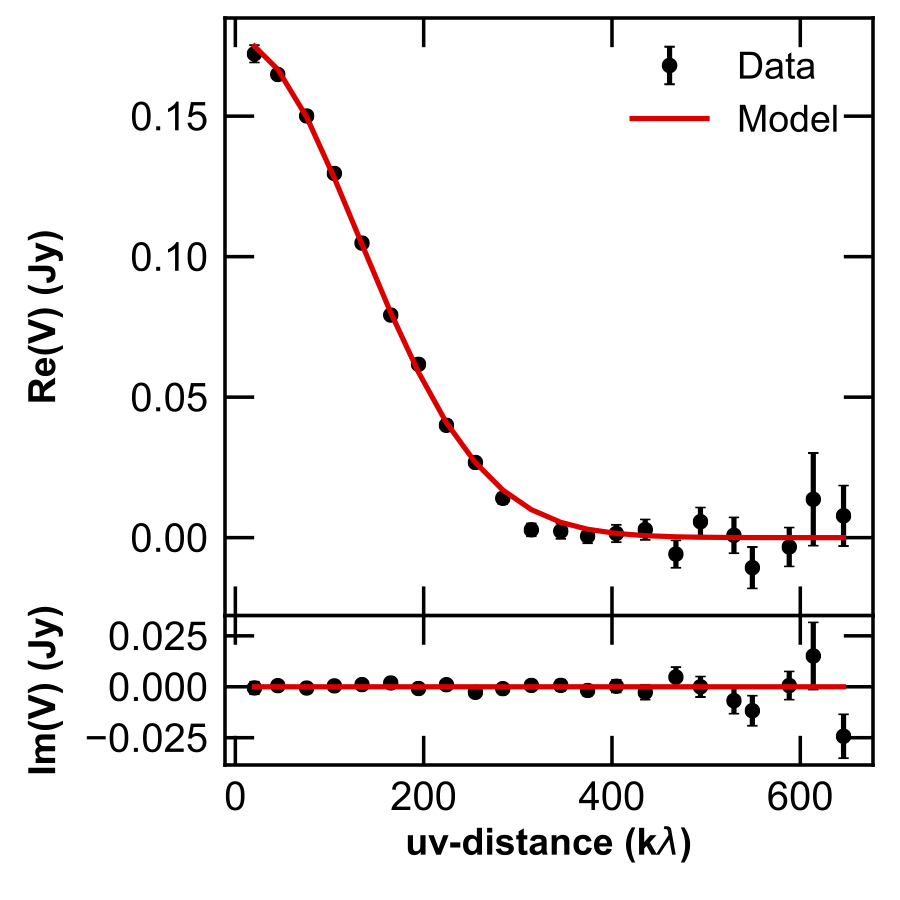

======
uvplot
======
A simple package to make nice plots of deprojected interferometric visibilities, often called **uvplots**.
It can be installed inside the `NRAO CASA package <https://casa.nrao.edu/>`_ (see instructions below) and has functionalities to export visibilities from the MS Table format to ASCII. Available on the `Python Package Index <https://pypi.python.org/pypi/uvplot>`_.

.. image:: https://travis-ci.org/mtazzari/uvplot.svg?branch=master
    :target: https://travis-ci.org/mtazzari/uvplot

.. image:: https://img.shields.io/pypi/v/uvplot.svg
    :target: https://pypi.python.org/pypi/uvplot

.. image:: https://img.shields.io/github/release/mtazzari/uvplot/all.svg
    :target: https://github.com/mtazzari/uvplot/releases
    
.. image:: https://img.shields.io/badge/License-LGPL%20v3-blue.svg
    :target: https://www.gnu.org/licenses/lgpl-3.0

.. image:: https://zenodo.org/badge/105298533.svg
   :target: https://zenodo.org/badge/latestdoi/105298533
   
|

The current version implements the basic plotting functionality.

Features on the road map:
    - handle MS tables with spectral windows with different number of channels;
    - choose specific channels to export;
    - import visibilities from ASCII to MS Table.

If you are interested, have feature requests, or encounter issues, consider creating an `Issue <https://github.com/mtazzari/uvplot/issues>`_ or writing me an `email  <marco.tazzari@gmail.com>`_. I am happy to have your feedback!

Installation
------------

**uvplot** works on `Python` >=2.7 and >=3.6 and can be installed with:

.. code-block :: bash

    pip install uvplot

To make **uvplot** available in CASA, run from the shell:

.. code-block :: bash

    casa-pip install uvplot

where `casa-pip` is a tool that can be downloaded at `https://github.com/radio-astro-tools/casa-python <https://github.com/radio-astro-tools/casa-python>`_.

To upgrade **uvplot** to a newer version on your system, just run:

.. code-block :: bash

    pip install --upgrade uvplot
    
To upgrade **uvplot** inside CASA use the `--no-deps` option to prevent `casa-pip` from automatically upgrading `numpy` and `matplotlib` (which is not allowed inside CASA and will lead to errors):

.. code-block :: bash

    casa-pip install --upgrade --no-deps uvplot
    
**uvplot** has been tested on CASA versions >= 4.7.0.

Features
--------

**1) Plotting visibilities**
============================
This is an example plot:

created with uvplot:

.. code-block:: py

    import numpy as np
    from uvplot import UVTable, arcsec
    from uvplot import COLUMNS_V0       # use uvplot >= 0.2.6

    wle = 0.88e-3         # Observing wavelength         [m]

    dRA = 0.3 * arcsec    # Delta Right Ascension offset [rad]
    dDec = 0.07 * arcsec  # Delta Declination     offset [rad]
    inc = np.radians(73.) # Inclination    [rad]
    PA = np.radians(59)   # Position Angle [rad]

    uvbin_size = 30e3     # uv-distance bin [wle]

    uv = UVTable(filename='uvtable.txt', wle=wle, columns=COLUMNS_V0)
    uv.apply_phase(dRA, dDec)
    uv.deproject(inc, PA)

    uv_mod = UVTable(filename='uvtable_mod.txt', wle=wle, COLUMNS_V0)
    uv_mod.apply_phase(dRA=dRA, dDec=dDec)
    uv_mod.deproject(inc=inc, PA=PA)

    axes = uv.plot(label='Data', uvbin_size=uvbin_size)
    uv_mod.plot(label='Model', uvbin_size=uvbin_size, axes=axes, yerr=False, linestyle='-', color='r')

    axes[0].figure.savefig("uvplot.png")

From version v0.2.6 it is necessary to provide the `columns` parameter
when reading an ASCII uvtable. The `columns` parameter can be specified
either as a parameter to the `UVTable()` command, or as the **2nd** line
in the ASCII file. The available `columns` formats are:

.. code-block:: bash

    FORMAT          COLUMNS                                                 COLUMNS_LINE (copy-paste as 2nd line in the ASCII file)
    COLUMNS_V0      ['u', 'v', 'Re', 'Im', 'weights']                       '# Columns      u v Re Im weights'
    COLUMNS_V1      ['u', 'v', 'Re', 'Im', 'weights', 'freqs', 'spws']      '# Columns      u v Re Im weights freqs spws'
    COLUMNS_V2      ['u', 'v', 'V', 'weights', 'freqs', 'spws']             '# Columns      u v V weights freqs spws'

To import an ASCII uvtable with 5 columns with uvplot < 0.2.6:

.. code-block:: py

    from uvplot import UVTable
    uvt = UVTable(filename='uvtable.txt', format='ascii', columns=COLUMNS_V0)

and with uvplot >= 0.2.6:

.. code-block:: py

    from uvplot import UVTable
    from uvplot import COLUMNS_V0  # ['u', 'v', 'Re', 'Im', 'weights']
    uvt = UVTable(filename='uvtable.txt', format='ascii', columns=COLUMNS_V0)

**2) Exporting visibilities** from MS table to uvtable (ASCII)
==============================================================
Once installed **uvplot** inside CASA (see instructions above),
it is possible to export the visibilities in `mstable.ms` to an ASCII table by executing these lines **from a CASA shell**:

.. code-block:: py

    CASA <1>: from uvplot import export_uvtable
    CASA <2>: export_uvtable("uvtable.txt", tb, vis='mstable.ms')

The resulting `uvtable.txt` will contain `u, v` coordinates (in meters), `Re(V), Im(V)` visibility measurements (in Jansky),
and `weights`. The table will also report the average wavelength (averaged among all selected spectral windows):

.. code-block:: bash

    # Extracted from mstable.ms.
    # wavelength[m] = 0.00132940778422
    # Columns:	u[m]	v[m]	Re(V)[Jy]	Im(V)[Jy]	weight
    -2.063619e+02	2.927104e+02	-1.453431e-02	-1.590934e-02	2.326950e+04
    3.607948e+02	6.620900e+01	-1.680727e-02	1.124862e-02	3.624442e+04
    5.752178e+02	-6.299933e+02	5.710317e-03	6.592049e-03	4.719500e+04
    -9.198434e+02	-1.374651e+03	1.313417e-03	4.299262e-03	4.259890e+04
    9.623210e+01	-4.631573e+02	7.731462e-03	-8.803369e-03	4.801395e+04
    9.348914e+01	-5.191096e+02	3.759772e-03	4.754967e-04	4.748304e+04
    1.108410e+03	-1.396906e+03	3.222965e-03	-5.164917e-03	4.690977e+04
    [...]

By default `export_uvtable` exports all channels in all spectral windows. However, it is also possible to specify which
spectral windows and channels to export. More details are given in the documentation of the `export_uvtable() <https://github.com/mtazzari/uvplot/blob/master/uvplot/io.py>`_ function.

License and Attribution
-----------------------
If you use **uvplot** for your publication, please cite the `Zenodo reference <https://zenodo.org/badge/latestdoi/105298533>`_ ::

    @misc{uvplot_mtazzari,
      author       = {Marco Tazzari},
      title        = {mtazzari/uvplot: v0.1.1},
      month        = oct,
      year         = 2017,
      doi          = {10.5281/zenodo.1003113},
      url          = {https://doi.org/10.5281/zenodo.1003113}
    }

**uvplot** is free software licensed under the LGPLv3 License. For more details see the LICENSE.

© Copyright 2018 Marco Tazzari and contributors.

Contributors
------------
Author:
    - `Marco Tazzari (University of Cambridge) <https://github.com/mtazzari>`_

Contributions to the code base:
    - `Patrick Cronin-Coltsmann <https://github.com/PColtsmann>`_
    - `Grant Kennedy <https://github.com/drgmk>`_

Documentation
-------------
Check out the `documentation <https://mtazzari.github.io/uvplot/>`_.

Changelog
---------
See the list of changes in all releases `here <https://github.com/mtazzari/uvplot/releases>`_.
